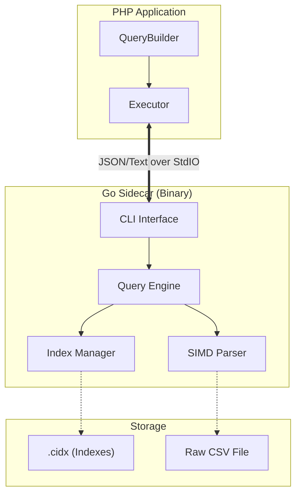

# CsvQuery (v1.0.0)

[](LICENSE)
[](go.mod)
[](composer.json)
[](#)

**CsvQuery** is a high-performance query engine designed to treat massive CSV files (10GB - 1TB+) like a searchable database. It uses a **PHP + Go SIMD Sidecar Architecture** to achieve sub-millisecond query latency without the overhead of a traditional database system.

## 🚀 Key Features

- **SIMD-Accelerated Parsing**: Uses AVX2/SSE4.2 instructions for hardware-speed CSV scanning.
- **High-Performance Indexing**: Single and composite column indexes with O(1) lookup.
- **Fluent PHP API**: Query massive CSVs using a familiar, chainable QueryBuilder.
- **Sidecar Architecture**: Go binary handles the heavy lifting via StdIO pipes.
- **Zero-Allocation Hot Paths**: Optimized memory management for extreme throughput.
- **Aggregations & Filters**: Built-in support for `WHERE`, `COUNT`, `SUM`, `DISTINCT`, and more.

## 🏗️ Architecture

CsvQuery operates as a high-performance CLI sidecar. Your PHP application communicates with the Go binary via standard I/O pipes.



## ⚡ Performance

Benchmarks on a **10GB CSV** dataset (18M rows) on MacBook M3 Max:

| Task | Performance |
| :--- | :--- |
| **Full File Indexing** | ~400,000 rows/sec (50s total) |
| **Indexed Query Latency** | **~14ms** |
| **High-Volume Scan** | ~430ms |

## 📦 Installation

### PHP Wrapper
```bash
composer require csvquery/csvquery
```

### Go Engine
```bash
go mod download
make build
```

## 🚥 Quick Start (PHP)

```php
use CsvQuery\CsvQuery;

$csv = new CsvQuery('data.csv');

// 1. Create indices for speed
$csv->createIndex(['EXAM_SESSION_ID', 'PROGRAMME_ID']);

// 2. Query like a Pro
$results = $csv->find()
    ->select(['ENROLMENT_NUMBER', 'MARKS'])
    ->where(['EXAM_SESSION_ID' => 'S2025'])
    ->andWhere(['>', 'MARKS', 40])
    ->limit(10)
    ->all();

print_r($results);
```

## 📖 Documentation

- [Getting Started](docs/GETTING_STARTED.md)
- [Architecture & Components](docs/ARCHITECTURE.md)
- [API Reference](docs/API.md)
- [Contributing Guide](CONTRIBUTING.md)

## ⚖️ License

Distributed under the MIT License. See `LICENSE` for more information.

## 🤝 Contributing

Contributions are welcome! Please read our [Contributing Guide](CONTRIBUTING.md) to get started.

---
**Developed with ❤️ by [CsvQuery Team](https://github.com/csvquery)**
