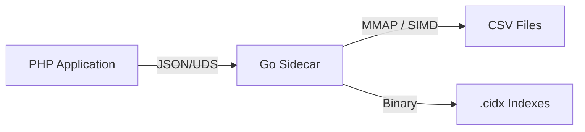

# CsvQuery Architecture

CsvQuery is designed for one thing: **Extreme performance on massive CSV files.**

## System Overview

The project uses a **Sidecar Architecture**, separating the high-level application logic (PHP) from the performance-critical data processing (Go).

## Data Flow

### 1. Requesting a Query
When you call `$query->all()` in PHP:
1. The `QueryBuilder` serializes the query into a JSON payload.
2. The `Executor` sends this payload over a **Unix Domain Socket (UDS)** to the Go daemon.

### 2. Execution (Go Engine)
The Go engine receives the plan and proceeds as follows:
- **Strategy Selection**: It checks if an index exists for the `WHERE` clause.
- **Indexed Path**: If an index exists, it loads the `.cidx` footer, finds the relevant blocks, decompresses them, and fetches only the required row offsets.
- **SIMD Path**: If no index exists, it fires up parallel workers using **SIMD (AVX2/SSE4.2)** to scan the raw CSV file for matches.

### 3. Response
Match offsets are used to read the raw data via `mmap` (zero-copy), and the results are streamed back to PHP as a JSON packet.

## Why SIMD?

Traditional CSV parsers check every byte for delimiters (`,`, `\n`). On modern CPUs, this is slow. SIMD allows CsvQuery to:
1. Load 32 bytes of the CSV into a YMM register.
2. Compare all 32 bytes against the delimiter byte in a **single CPU cycle**.
3. Use bitwise masks to find the positions of all delimiters instantly.

This approach reaches speeds of over **10GB/s** on modern hardware.

## Why Indexes? (The `.cidx` format)

Indexes are stored as compressed block files. Unlike a traditional database index that might use a B-Tree, CsvQuery uses a **Sorted Block Index**:
- Keys are sorted and grouped into 64KB blocks.
- Blocks are compressed with **LZ4**.
- A small "Sparse Footer" allows jumping to any key immediately.
- This results in an index that is often **5-10x smaller** than the original data while providing O(log N) search speed.

## Performance Characteristics

- **Memory Bound**: Index creation is multi-threaded and depends on memory bandwidth.
- **I/O Bound**: Scans are limited by disk read speed (NVMe recommended).
- **Latency**: UDS communication adds <1ms overhead.

---
Next: [Learn about the individual Components](COMPONENTS.md)
