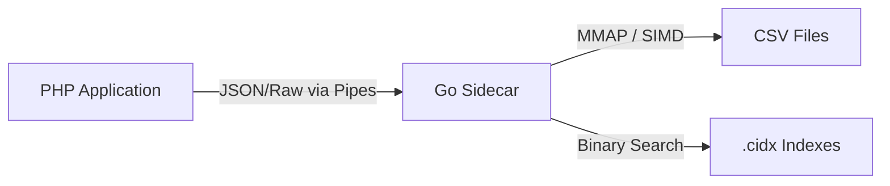

# CsvQuery Architecture

CsvQuery is designed for one thing: **Extreme performance on massive CSV files.**

## System Overview

The project uses a **Sidecar Architecture**, separating the high-level application logic (PHP) from the performance-critical data processing (Go). Communication happens over standard input/output (StdIO) pipes.

## 🔄 Query Lifecycle Flow

The journey of a query from PHP to results involves these **8 numbered phases**:

1.  **[PHP] Query Definition**: User defines a query using the fluent `QueryBuilder`.
2.  **[PHP] Payload Serialization**: The parameters (`where`, `limit`, `groupBy`) are serialized into a **JSON Request**.
3.  **[Bridge] Process Spawn**: The PHP `Client` spawns the `bin/csvquery` Go binary and writes the JSON payload to its **STDIN**.
4.  **[Go] Initialization**: Go unmarshals the request and prepares the environment (loading metadata and file descriptors).
5.  **[Go] Engine Routing**: 
    - If a matching `.cidx` exists, Go performs an **Indexed Scan** (Binary search on sparse blocks).
    - If no index is found, Go performs a **Parallel SIMD Scan** (Multiplexed mmap chunks).
6.  **[Go] Data Extraction**: Go uses zero-copy `mmap` to access the raw CSV data. It applies any additional filters not covered by the index.
7.  **[Bridge] Response Streaming**: Found record markers (`offset,line`) or aggregation results are streamed back to PHP via **STDOUT**.
8.  **[PHP] Hydration**: PHP reads the stream, closes the process, and returns a `Result` object populated with data.

## Why SIMD?

Traditional CSV parsers check every byte for delimiters (`,`, `\n`). On modern CPUs, this is slow. SIMD allows CsvQuery to:
1. Load 32 bytes of the CSV into a YMM register.
2. Compare all 32 bytes against the delimiter byte in a **single CPU cycle**.
3. Use bitwise masks to find the positions of all delimiters instantly.

This approach reaches speeds of over **10GB/s** on modern hardware.

## Why Indexes? (The `.cidx` format)

Indexes are stored as compressed block files using a **Sorted Block Index**:
- Keys are sorted and grouped into 64KB blocks.
- Blocks are compressed with **LZ4**.
- A small "Sparse Footer" allows jumping to any key immediately.
- Resulting indexes are often **5-10x smaller** than the original data while providing O(log N) search speed.

## Performance Characteristics

- **Memory Bound**: Index creation is multi-threaded and depends on memory bandwidth.
- **I/O Bound**: Scans are limited by disk read speed (NVMe recommended).
- **Latency**: Process spawning adds ~10-20ms overhead; subsequent operations are sub-millisecond.

---
Next: [Learn about the individual Components](COMPONENTS.md)
